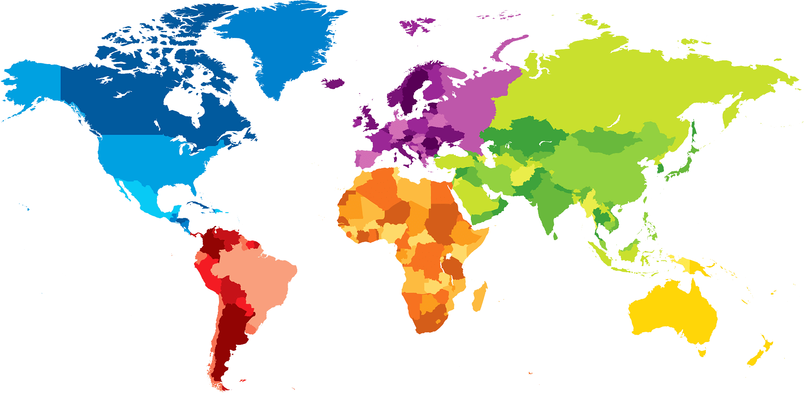

# mapPy

## What is mapPy?
A video game where you guess the capital for any country on Planet Earth. Each player takes turns to guess. If the previous player gets the correct captial, then they can choose the region of Planet Earth the next player is challenged to.

This may be extended to other planets in the near future, when we become a multi-planetary species .

## Motivation
This is one of the classic games that my family and I play together in person. The motivation for this PyGame is to enable us to play it remotely.

## Documentation

Documentation is stored in the docs folder. In there you'll find information about:

- how to install the game
- contributing to the project
- instructions on how to play the game
